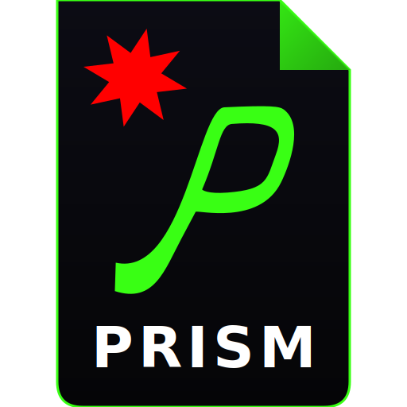
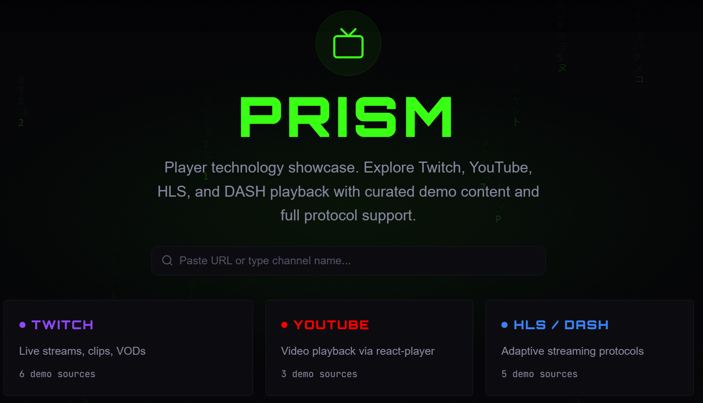
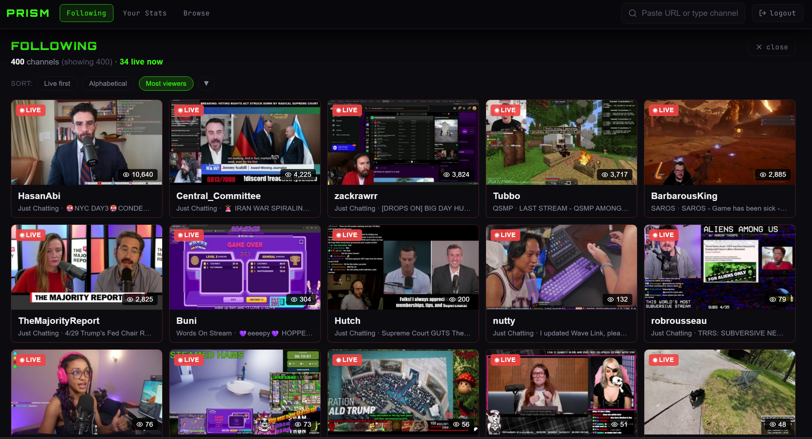
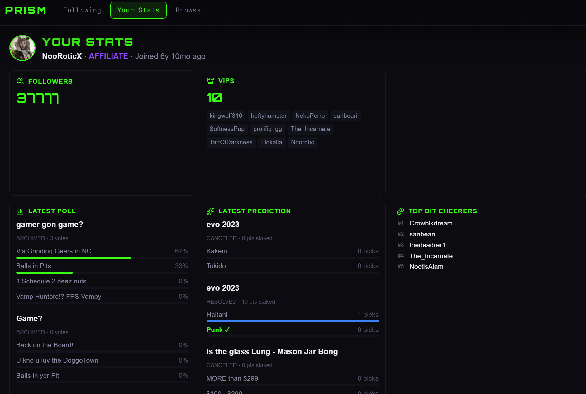
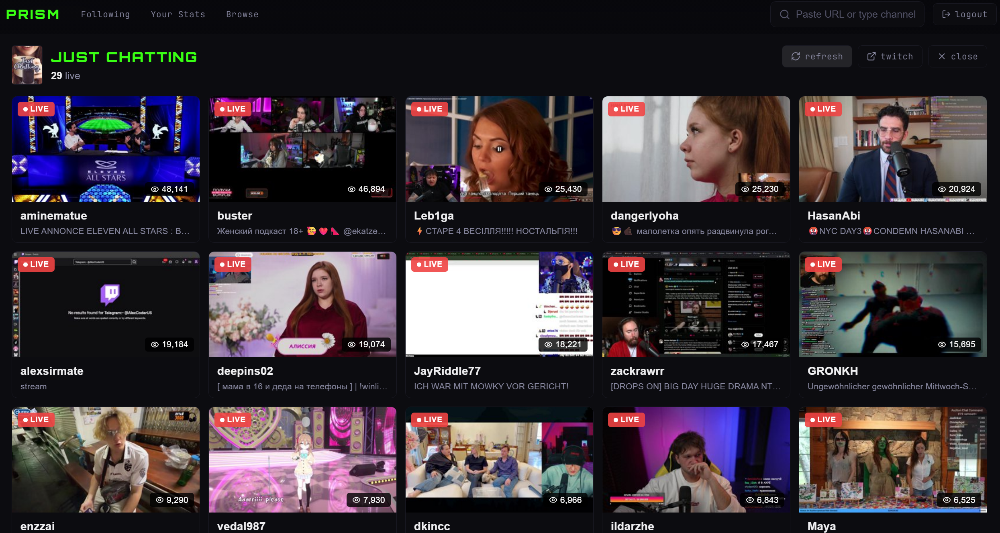

<p align="center">
  
</p>

<p align="center">
  
</p>

<h1 align="center">PRISM</h1>

<p align="center">
  <strong>Paste a URL. Watch it. That's the whole pitch.</strong>
</p>

<p align="center">
  Twitch, YouTube, HLS, DASH. One input field handles all of them.<br/>
  For Twitch channels, it goes deeper: profiles, clips, VODs, stats, emotes, badges, embedded chat.
</p>

<p align="center">
  <a href="https://prism.nooroticx.tv">Live</a>
  &nbsp;&middot;&nbsp;
  <a href="#quick-start">Quick Start</a>
  &nbsp;&middot;&nbsp;
  <a href="#features">Features</a>
  &nbsp;&middot;&nbsp;
  <a href="#architecture">Architecture</a>
</p>

---

<p align="center">
  
</p>

## Why does this exist?

I got tired of opening four different sites to test streams across protocols. Twitch Embed SDK, Video.js, dash.js, react-player: each handles one format well. PRISM wires them together behind a single URL input that auto-detects what you pasted and routes it to the right engine.

Type a Twitch username, it loads the channel. Paste an `.m3u8`, it plays HLS. Drop a YouTube link, it just works. No dropdowns, no protocol pickers.

## Quick Start

```bash
git clone https://github.com/NooRotic/prism.git
cd prism
pnpm install
cp .env.example .env
```

Add your keys to `.env`:

```env
VITE_TWITCH_CLIENT_ID=       # https://dev.twitch.tv/console/apps
VITE_YOUTUBE_API_KEY=         # YouTube Data API v3 (optional)
```

```bash
pnpm dev
```

Open [localhost:5000](http://localhost:5000).

## Features

### Multi-Protocol Playback

| Protocol | Engine | What it plays |
|----------|--------|---------------|
| **Twitch** | Embed SDK, iframe fallback | Live streams, clips, VODs |
| **YouTube** | react-player | Videos |
| **HLS** | Video.js | `.m3u8` adaptive streams |
| **DASH** | dash.js | `.mpd` manifests |
| **Direct** | Video.js | MP4, MOV, AVI |

The player runs a fallback chain. If the primary engine crashes, it tries the next one automatically. There's a debug overlay that shows which engine is active and where you are in the chain.

### Smart URL Input

The input field classifies what you type in real time:

- **Full URL**: color-coded badge (purple for Twitch, red for YouTube, blue for HLS/DASH)
- **Single word**: treated as a Twitch channel name
- **Multiple words**: game/category search
- **Empty + focused**: top category quick links

### Twitch Channel Explorer

Authenticate with Twitch OAuth and the whole channel opens up:

<p align="center">
  
</p>

**Following panel**: every channel you follow with live status, sortable by viewers, alphabetical, or live-first. Cursor-based pagination handles large follow lists.

<p align="center">
  
</p>

**Your Stats panel**: followers, subscribers, tier points, goals, VIPs, hype trains, polls, predictions, bits leaderboard. Each section loads independently with its own error state.

<p align="center">
  
</p>

**Category browse**: live streams in any game/category with viewer counts, tags, and stream metadata.

Plus: profile sidebar with broadcaster badge and emote/badge counts. Clip grid and VOD grid. Embedded Twitch chat with a resizable divider (drag handle, ratio persisted in localStorage).

### Display Modes

| Mode | When |
|------|------|
| **Idle** | Hub page: protocol cards + URL input |
| **Streamer** | Full layout for affiliate/partner channels |
| **Chatter** | Simplified view for non-streamer users |
| **Video** | Standalone player for non-Twitch URLs |

### Visual Design

Dark theme. `#050507` base, neon green (`#39FF14`) accent, Twitch purple (`#9146FF`) for Twitch-specific elements.

Matrix rain background (canvas-based falling katakana), brushed metal textures (SVG feTurbulence), atmospheric noise overlay, staggered reveal animations. Animated onboarding intro with anime.js (skippable).

## Tech Stack

| Layer | What |
|-------|------|
| Framework | React 19 + TypeScript |
| Build | Vite 8 |
| Styling | Tailwind CSS v4 |
| Routing | react-router-dom v7 |
| Players | Twitch Embed SDK, Video.js, dash.js, react-player |
| Animation | anime.js v4 |
| Testing | Vitest + Testing Library |
| Deploy | GitHub Pages |

## Architecture

```
src/
  App.tsx                        # Router + layout + onboarding
  contexts/AppContext.tsx         # Global state (useReducer)
  lib/
    urlDetection.ts              # URL classification engine
    twitchApi.ts                 # Twitch Helix API (20+ endpoints)
    twitchAuth.ts                # OAuth implicit grant flow
    youtubeApi.ts                # YouTube Data API v3
  pages/
    HubPage.tsx                  # Landing page
    TwitchPlayerPage.tsx         # Stream + chat + profile + clips
    YoutubePlayerPage.tsx        # YouTube player
    HlsDashPlayerPage.tsx        # HLS/DASH player
  components/
    player/PlayerHost.tsx        # Multi-engine fallback chain
    search/SmartUrlInput.tsx     # URL input with detection
    channel/ProfileSidebar.tsx   # Channel profile panel
    channel/ClipGrid.tsx         # Clips browser
    ui/MatrixRainBackground.tsx  # Canvas matrix rain
```

State management is a single `useReducer` covering auth, search, channel data, player engine management, and display modes. All player components lazy-load via `React.lazy`.

## Routes

| Path | Page |
|------|------|
| `/` | Hub (landing) |
| `/twitch` | Twitch protocol page |
| `/twitch/:channel` | Twitch player |
| `/youtube` | YouTube protocol page |
| `/youtube/:videoId` | YouTube player |
| `/hls-dash` | HLS/DASH protocol page |
| `/hls-dash/:streamId` | HLS/DASH player |

## Scripts

```bash
pnpm dev        # Dev server (port 5000)
pnpm build      # TypeScript check + production build
pnpm preview    # Preview production build
pnpm lint       # ESLint
pnpm test       # Vitest
```

## Deployment

GitHub Pages via GitHub Actions on push to `main`. Vite builds to `dist/`, SPA routing handled via `404.html` redirect.

Live at [prism.nooroticx.tv](https://prism.nooroticx.tv)

## License

MIT

---

<p align="center">
  
</p>

<p align="center"><strong>C.R.E.A.M.</strong><br/>Code Rules Everything Around Me.</p>
